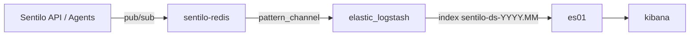

# ELK

## Setup

Ao utilizar o script de inicialização **server.sh**, entre dentro do container do
elastic e execute *bin/elasticsearch-setup-passwords*, de acordo com o arquivo
**.envsrc** da raíz do projeto.

Após estar funcionando corretamente, entre na kibana e crie uma role e user para 
o Logstash, novamente, com as mesmas credenciais colocadas no arquivo **.envsrc**

O **index template** `sentilo-ds` é aplicado automaticamente ao subir o ELK
(serviço `setup-index-template` no compose). Para reaplicar manualmente:

```bash
source .envsrc
chmod +x ELK/setup-index-template.sh
./ELK/setup-index-template.sh
```

---

## Mapeamento de dados (Redis → Logstash → Elasticsearch → Kibana)

O mapping dos índices `sentilo-ds-*` é definido pelo **index template** versionado em
`elasticsearch/index-templates/sentilo-ds.json`, aplicado antes do Logstash indexar dados.

A transformação dos eventos está em `logstash/pipeline/pipeline.conf`.

### Index template (`sentilo-ds`)

Arquivo: `elasticsearch/index-templates/sentilo-ds.json`

```json
{
  "index_patterns": ["sentilo-ds-*"],
  "priority": 100,
  "template": {
    "mappings": {
      "properties": {
        "location_geo": { "type": "geo_point" },
        "sensor":       { "type": "keyword" },
        "@timestamp":   { "type": "date" }
      }
    }
  }
}
```

| Campo          | Tipo        | Origem                                              |
|----------------|-------------|-----------------------------------------------------|
| `location_geo` | `geo_point` | Gerado no Logstash a partir de `location` (`lat lon` → `lat, lon`) |
| `sensor`       | `keyword`   | Campo Redis / Grok                                  |
| `@timestamp`   | `date`      | Timestamp de ingestão do Logstash                   |

> **Índices já existentes:** se `sentilo-ds-*` foi criado antes do template, o mapping
> não muda retroativamente. Apague os índices antigos ou faça reindex antes de reindexar dados.

### Fluxo



1. A plataforma Sentilo publica eventos no Redis (`sentilo-redis`).
2. O Logstash assina canais que casam com o padrão `/*[data,order,alarm]/*`.
3. Os eventos são transformados (Grok + JSON) e gravados no índice mensal `sentilo-ds-YYYY.MM`.
4. No Kibana, é necessário criar manualmente um **Data View** apontando para `sentilo-ds-*`.

### Entrada (Redis)

```ruby
# logstash/pipeline/pipeline.conf
redis {
    host => "sentilo-redis"
    password => "sentilo"
    data_type => "pattern_channel"
    key => "/*[data,order,alarm]/*"
}
```

| Parâmetro    | Valor                          | Significado                                      |
|--------------|--------------------------------|--------------------------------------------------|
| `data_type`  | `pattern_channel`              | Assina canais por padrão (não uma chave fixa)    |
| `key`        | `/*[data,order,alarm]/*`       | Eventos de **data**, **order** e **alarm**       |

O campo `sensor` traz o identificador do sensor (ex.: `air-quality-comp1_TEMP`).

### Transformação (filtros Logstash)

**1. Grok no campo `sensor`** — tenta decompor o ID do sensor:

| Padrão Grok | Campos extraídos                          | Exemplo de sensor              |
|-------------|-------------------------------------------|--------------------------------|
| 1           | `component`, `sensor_type`, `sensor_number` | `comp1_TEMP_1`              |
| 2           | `component`, `sensor_type`, `sensor_flag`   | `comp1_TEMP_flag`           |
| 3           | `sensor_type`, `sensor_number`              | `TEMP_1`                    |
| 4 (fallback)| — (mantém `sensor` original)                | qualquer outro formato      |

**2. JSON no campo `message`** — o payload da observação Sentilo é parseado e
expandido como campos de primeiro nível no documento.

**3. Campos removidos** após o parse:

```
event, topic, version, time, timestamp
```

**4. `location_geo`** — se o campo `location` existir (formato `"lat lon"`), o Logstash
copia e converte para `"lat, lon"`, formato aceito pelo `geo_point` do Elasticsearch.

> Esses campos removidos são metadados do Redis/pub-sub. O `@timestamp` de ingestão
> é adicionado automaticamente pelo Logstash.

### Saída (Elasticsearch)

```ruby
elasticsearch {
    hosts => "http://es01:9200"
    user =>  "${LOGSTASH_USER}"
    password => "${LOGSTASH_PASSWORD}"
    index => "sentilo-ds-%{+yyyy.MM}"
    action => "create"
}
```

| Item            | Valor / comportamento                              |
|-----------------|----------------------------------------------------|
| Padrão de índice| `sentilo-ds-2026.06` (um índice por mês)           |
| `action`        | `create` — não sobrescreve documentos com mesmo ID |
| Mapping         | Index template `sentilo-ds` (campos fixos + dynamic mapping para o restante) |

### Campos esperados no documento indexado

Dependem do payload que a Sentilo publica no Redis. Em geral, após o pipeline:

| Origem        | Campo(s) típico(s)     | Tipo inferido pelo ES |
|---------------|------------------------|-----------------------|
| Grok          | `component`            | `text` + `.keyword`   |
| Grok          | `sensor_type`          | `text` + `.keyword`   |
| Grok          | `sensor_number`        | `long` ou `text`      |
| Grok          | `sensor_flag`          | `text` + `.keyword`   |
| Redis         | `sensor`               | `keyword` (template)  |
| Logstash      | `location_geo`         | `geo_point` (template)|
| Logstash      | `@timestamp`           | `date` (template)     |
| JSON message  | `value`                | `text` ou `float`     |
| JSON message  | `location`             | `text` + `.keyword`   |
| JSON message  | outros campos do JSON  | conforme conteúdo     |

Exemplo de observação enviada pelos forwarders (antes de chegar ao Redis):

```json
{
  "observations": [{
    "value": "{\"raw_value\": 25.3, \"coordinates\": {\"lat\": -24.73, \"lon\": -53.73}}",
    "timestamp": "12/06/2026T14:30:00Z",
    "location": "-24.73 -53.73"
  }]
}
```

> O formato exato no índice depende de como a Sentilo serializa o evento no canal Redis.
> Para inspecionar: Kibana → Discover, ou `GET sentilo-ds-*/_search` na API do ES.

### Kibana — Data View (configuração manual)

Não há data view exportada no repositório. Após o primeiro dado indexado:

1. Acessar Kibana em `/kibana` (via proxy) ou diretamente no container.
2. **Stack Management → Data Views → Create data view**
3. Configurar:
   - **Name:** `Sentilo Data`
   - **Index pattern:** `sentilo-ds-*`
   - **Timestamp field:** escolher o campo de data disponível (ex.: `@timestamp` do Logstash ou `timestamp` do payload — verificar no Discover)
4. Salvar e usar em **Discover** / **Dashboards**.

### Verificar mapping de um índice

```bash
# Listar índices
curl -u elastic:SENHA http://localhost:9200/_cat/indices/sentilo-ds-*?v

# Ver mapping do índice do mês atual
curl -u elastic:SENHA http://localhost:9200/sentilo-ds-2026.06/_mapping?pretty
```

### Ajustes comuns em produção

| Necessidade                         | Onde alterar                          |
|-------------------------------------|---------------------------------------|
| Novos tipos de evento no Redis      | `key` no input Redis do `pipeline.conf` |
| Decompor IDs de sensor diferentes   | Padrões Grok em `pipeline.conf`       |
| Campos com tipo fixo (ex.: `value` como `float`) | Adicionar ao `sentilo-ds.json` e reaplicar template |
| Retenção / rollover de índices      | ILM policy no ES (não configurado)    |
| Dashboards prontos                  | Exportar do Kibana e versionar (TODO) |

### Troubleshooting

**Kibana sem dados**
- Confirmar que o Data View `sentilo-ds-*` existe.
- Verificar se há índices: `curl .../_cat/indices/sentilo-ds-*`
- Conferir logs do Logstash: `docker logs elastic_logstash`

**Campos com tipo errado**
- Dynamic mapping fixa o tipo no primeiro documento indexado.
- Se o primeiro `value` for texto e depois vier número, pode haver conflito.
- Solução: index template com mapping explícito + reindex (ou novo índice).

**Grok não extrai `component` / `sensor_type`**
- O ID do sensor pode não casar com os padrões definidos.
- Inspecionar o campo `sensor` bruto no Discover e ajustar os padrões Grok.
